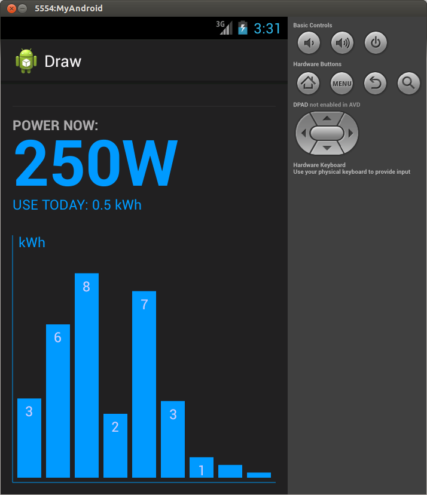

## Android App Part 2 - Drawing an Energy Monitoring display with java 2d canvas

Complete code example, MainActivity.java:

    package com.example.draw;

    import java.util.Iterator;
    import java.util.LinkedHashMap;

    import android.os.Bundle;
    import android.app.Activity;
    import android.content.Context;
    import android.graphics.Canvas;
    import android.graphics.Color;
    import android.graphics.Paint;
    import android.graphics.Paint.Align;
    import android.graphics.Typeface;
    import android.util.Log;
    import android.view.View;

    public class MainActivity extends Activity {

	    @Override
	    protected void onCreate(Bundle savedInstanceState) {
		    super.onCreate(savedInstanceState);
		
		    DrawView drawView = new DrawView(this);
            setContentView(drawView);
	    }
    }

    class DrawView extends View {
	    Paint paint = new Paint(Paint.ANTI_ALIAS_FLAG);
	
        public DrawView(Context context) {
            super(context);
        }
        
        @Override
        public void onDraw(Canvas canvas) {
        	
        	float power = 250.4f;
        	
            // Example data
            LinkedHashMap data = new LinkedHashMap<Integer, Float>();
            data.put(1401321600, 3.1f);
            data.put(1401408000, 6.0f);
            data.put(1401494400, 8.0f);
            data.put(1401580800, 2.5f);
            data.put(1401667200, 7.3f);
            data.put(1401753600, 3.0f);

            data.put(1401840000, 0.8f);
            data.put(1401926400, 0.5f);
            data.put(1402012800, 0.4f);
            data.put(1402012800, 0.2f);
            
            draw_myElectric(canvas,power,data);
        }
        
        public void draw_myElectric(Canvas canvas, Float power, LinkedHashMap data)
        {
            // Typeface definitions
        	Typeface robotoNormal = Typeface.create("Roboto",Typeface.NORMAL);
        	Typeface robotoBold = Typeface.create("Roboto",Typeface.BOLD);
        	
        	// Clear background
        	paint.setColor(Color.parseColor("#222222"));
            canvas.drawRect(0, 0, getWidth(), getHeight(), paint);
        	
        	// View needs to be responsive to different screen width's and heights
        	// and whether the display is in portrait or landscape mode
        	//-------------------------------------------------------------------------
        	
            int screenWidth = getWidth();
            int screenHeight = getHeight();
            
            float scale = 1.0f;
            
            float left = 0;
            float top = 0;
            float graphWidth = 0;
            float graphHeight = 0;
            
        	if (screenWidth<screenHeight) {
        		// Portrait mode:
        		scale = screenWidth / 720.0f;
       
        		left = 30*scale;
        		graphWidth = screenWidth - 60*scale;
        		
        		graphHeight = 0.6f * screenHeight;
        		top = screenHeight - graphHeight-(30*scale);
        		
        	} else {
        		// Landscape mode:
        		scale = screenHeight / 720.0f;
        		
        		left = screenWidth * 0.35f;
        		graphWidth = screenWidth * 0.65f - 30*scale;
        		
        		top = (90*scale);
        		graphHeight = screenHeight - (120*scale);
        	}
        	
        	// Power now text and value's
        	//-------------------------------------------------------------------------
            
            // Grey horizontal line at the top
            paint.setColor(Color.parseColor("#333333"));
            canvas.drawLine(30*scale, 60*scale, screenWidth-30*scale, 60*scale, paint);
        	
            // My Electric text
        	paint.setTypeface(robotoBold);
            paint.setColor(Color.parseColor("#aaaaaa"));
            paint.setTextSize((int)35*scale);
            canvas.drawText("POWER NOW:", 30*scale, (int)120*scale, paint);
            
            // Power value text
            paint.setColor(Color.parseColor("#0699fa"));
            paint.setTextSize(160*scale);        
            canvas.drawText(String.format("%.0f", power)+"W", 30*scale, 260*scale, paint);

            // kwh text
            paint.setTypeface(robotoNormal);
            paint.setTextSize((int)35*scale);
            canvas.drawText("USE TODAY: 0.5 kWh", 30*scale, (int)320*scale, paint);

            // Start of graph drawing:
        	//-------------------------------------------------------------------------
            
            // Margin and inner dimensions
            float margin = 12 * scale;
            float innerWidth = graphWidth - 2*margin;
            float innerHeight = graphHeight - 2*margin;
            
            // Draw Axes
            paint.setColor(Color.rgb(6,153,250));
            canvas.drawLine(left, top, left, top+graphHeight, paint);
            canvas.drawLine(left, top+graphHeight, left+graphWidth, top+graphHeight, paint);
            
            // Draw kWh label top-left
            paint.setTextSize(35*scale);
            canvas.drawText("kWh", left+10, top+30*scale, paint);

            // Auto detect xmin, xmax, ymin, ymax
            float xmin = 0;
            float xmax = 0;
            float ymin = 0;
            float ymax = 0;
            boolean s = false;

            Iterator<Integer> keySetIterator = data.keySet().iterator();
            while(keySetIterator.hasNext()){
                Integer time = keySetIterator.next();
                float value = (Float) data.get(time);

                if (!s) {
                    xmin = time;
                    xmax = time;
                    ymin = value;
                    ymax = value;
                    s = true;
                }

                if (value>ymax) ymax = value;
                if (value<ymin) ymin = value;
                if (time>xmax) xmax = time;
                if (time<xmin) xmin = time;               
            }
            
            float r = (ymax - ymin);
            ymax = (ymax - (r / 2f)) + (r/1.5f);
            // Fixed min y
            ymin = 0;

            float barWidth = 3600*20;
            xmin -= barWidth /2;
            xmax += barWidth /2;

            float barWidthpx = (barWidth / (xmax - xmin)) * innerWidth;

            // kWh labels on each bar
            paint.setTextAlign(Align.CENTER);
            paint.setTextSize(35*scale);

            keySetIterator = data.keySet().iterator();

            while(keySetIterator.hasNext()){

                Integer time = keySetIterator.next();
                float value = (Float) data.get(time);

                float px = ((time - xmin) / (xmax - xmin)) * innerWidth;
                float py = ((value - ymin) / (ymax - ymin)) * innerHeight;

                float barLeft = left + margin + px - barWidthpx/2;
                float barBottom = top + margin + innerHeight;

                float barTop = barBottom - py;
                float barRight = barLeft + barWidthpx;

                paint.setColor(Color.rgb(6,153,250));
                canvas.drawRect(barLeft,barTop,barRight,barBottom,paint);

                // Draw kwh label text
                if (py>38*scale) {
                  paint.setColor(Color.parseColor("#ccccff"));
                  int offset = (int)(45*scale);
                  canvas.drawText(String.format("%.0f", value), left+margin+px, barTop + offset, paint);
                }
            }
        }
    }

