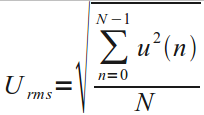

## AC Power Theory - Advanced maths

***

This page covers the mathematics behind calculating real power, apparent power, power factor, RMS voltage and RMS current from instantaneous Voltage and Current measurements of single phase AC electricity. Discrete time equations are detailed since the calculations are carried out in the Arduino in the digital domain. 

For a much nicer Arduino code snippet version of this page, see: [AC Power theory - Arduino maths](arduino-maths).

#### Real Power

Real power (also known as active power) is defined as the power used by a device to produce useful work.

Mathematically it is the definite integral of voltage, u(t), times current, i(t), as follows:

 

**_Equation 1._** _Real Power Definition._

U - Root-Mean-Square (RMS) voltage.

I - Root-Mean-Square (RMS) current.

_cos(φ) -_ Power factor.

The discrete time equivalent is:

 

**_Equation 2._** _Real Power Definition in Discrete Time._

u(n) - sampled instance of u(t)

i(n) - sampled instance of i(t)

N - number of samples.

Real power is calculated simply as the average of N voltage-current products. It can be shown that this method is valid for both sinusoidal and distorted waveforms.

#### RMS Voltage and Current Measurement

An RMS value is defined as the square root of the mean value of the squares of the instantaneous values of a periodically varying quantity, averaged over one complete cycle. The discrete time equation for calculating voltage RMS is as follows:

 

**_Equation 3._** _Voltage RMS Calculation in Discrete Time Domain._

RMS current is calculated using the same equation, substituting voltage samples, u(n), for current samples, i(n).

#### Apparent Power and Power Factor

Apparent power is calculated, as follows:

_Apparent power = RMS Voltage x RMS current_

and the power factor:

_Power Factor = Real Power / Apparent Power_

This page is based on Atmel's AVR465 appnote page 12-15 which can be found [here](http://www.atmel.com/dyn/resources/prod_documents/doc2566.pdf)
