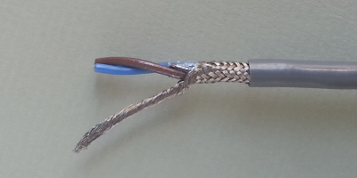
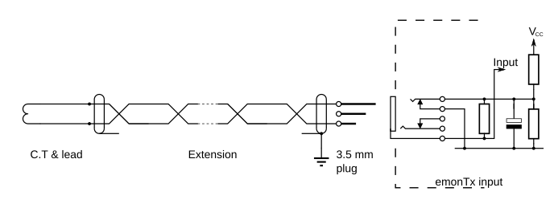

## Extending the Current Transformer Cable

***

In some installations, it might be necessary to extend the cable from a current transformer (c.t.). Often, this is because you want to measure real power, but there is no power socket at, or close, to the only place where you can mount the c.t. If this is the case, your only option may be to extend the c.t. cable.

The output from a true current transformer is a current. The c.t. will generate whatever voltage is needed to make that current flow in the burden resistor, where it is converted into a voltage, which will range from zero to about 1 – 1.5 V. If you have a c.t. with an internal burden, the “voltage output” type, then the output is the voltage that appears across the burden resistor, but the current is very small. In both cases, the cable that you need and how you connect it will be the same.
There should be no real limit to the maximum length of the cable that you can have. Voltage drop is largely irrelevant, and the main limiting factor is likely to be interference from outside sources.

### Materials

- A length of twin screened “microphone” cable.
- A 3-pole “stereo” 3.5 mm jack plug.
- A length of wire to earth the cable screen.
- Sleeving to insulate & protect the joints.

### Choice of cable

You should choose a cable designed for microphones. This will have twin twisted cores with an overall braided screen. A ‘braided’ screen is better than ‘lapped’. The more tightly the screen is woven, the better it will be at keeping out interference.

This is a high quality cable of the kind that is suitable.
Provided that your c.t. secondary current is small, less than a few hundred milliamps, then the current rating of the conductors will be irrelevant, and you should choose a cable that is strong so that it will safely resist any possible mechanical damage. The cable cores (but not the cable screen and sheath) should be small enough to pass through the opening in the 3.5 mm plug housing.
If you have a c.t. with a 1 A or 5 A secondary, and the burden resistor is at the other end of the cable to the c.t, then the cable size is important, and you must use a suitably rated cable.

### Wiring

Remove the 3.5 mm jack plug from your c.t. (If it is moulded on, you must cut it off. If you do not wish to cut the plug off, obtain an “in-line” socket.)
Install the cable and prepare the ends.

Decide at which end of the cable you have a good earth connection. You must connect the cable screen to earth at one end only. If you have a choice, connect the earth at the emonTx/emonPi end. If you do not have an earth connection, then you may connect to the emonTx/emonPi’s GND.

At both ends, strip back the outer sheath. At the end that will be earthed, comb out (or unwind) the cable screen. Join the earth wire to the screen, and connect to the earth connection. At the end that will not be earthed, cut back and insulate the cable screen.

At the c.t. end, join the two cores of the c.t’s cable onto the two inner cores of the new cable. Do not connect the screen of the c.t’s cable (if it is screened).

At the emonTx/emonPi end, connect the two cores of the extension cable to the plug tip and sleeve. To maintain the phase relationship, connect the red core of the c.t’s cable via the extension cable to the plug tip, and the white core of the c.t’s cable to the plug sleeve. If you have an American c.t. with white and black twisted wires, connect the white wire through the extension cable to the plug tip and the black wire to the sleeve. There is no connection to the plug ring.

### Can I use a ready-made headphone extension lead?

This is not ideal. If it is unscreened, then maybe. But it will be liable to pick up interference from adjacent wiring etc. If it is screened, then it is definitely not a good idea. The screen will be connected to the plug sleeve, which is in fact the input connection. So far from screening the wanted signal, the screen can easily make things worse.

### Can I use network cable?

If you have a screened cable (FTP/STP or S/UTP, CAT5 or CAT6), then this should be OK, and can be an attractive solution if you have several c.t’s at the same location. An unscreened cable is not ideal, and will be more liable to pick up unwanted interference from adjacent wiring etc.
Bear in mind that the cores of the network cable might not be stranded, which would make them liable to break more easily than a stranded conductor.
I have several c.t’s in one place.

### Can I use a multi-core cable?

Yes, but ideally you want a telephony-type cable where pairs of wires are twisted together. Use one pair for each c.t.

If you must use a multicore cable that does not have twisted pairs, try to pick the pairs of wires at random, so that all the ‘signal’ wires and all the ‘earthy’ wires are not bunched together.
You should try not to use one common connection for one side of all the c.t’s. If it is impossible to avoid a common connection, you must connect the common connection to the ‘earthy’ side of the jack plug at the emonTx or emonPi, which is the plug tip, not the sleeve as you would expect. (Check the circuit diagram for any other device.)

### Theory

There are two routes by which interference can get into the cable, and so be measured along with the wanted signal – as a magnetic field or as an electric field.
The magnetic field is counteracted by twisting the cores inside the cable. Alternate half-twists will pick up the field in the opposite sense, so the induced currents will cancel. The cable screen will have little or no effect.

The electric field will be intercepted by the cable screen, and conducted to earth through the earth connection. It is important not to earth the screen at both ends, as this could give rise to a current that circulates in the loop formed by the cable screen, earth and the two earth connections.