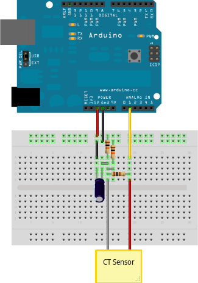

## How to Build an Arduino Energy Monitor - Measuring Mains Current Only

***

This guide details how to build a simple energy monitor on a breadboard that can be used to measure how much electrical energy you use in your home. It measures current, but uses an assumed fixed value for voltage (230V, if you're in the UK) and calculates apparent power. Although not as accurate as a monitor that measures voltage as well as current, it is a method commonly used in commercially available whole house energy monitors for reasons of simplicity and cost.

Here's how to build it:

#### Step 1: Gather Components

**You will need:**

1 x Arduino

**Current sensing electronics**

1 x CT sensor YHDC SCT-013-000

1 x Burden resistor 18 Ohms if supply voltage is 3.3V, or 33 Ohms if supply voltage is 5V.

2 x 10k Ohm resistors (or any equal value resistor pair up to 470k Ohm)

1 x 10uF capacitor

**Other**

A breadboard and some single core wire.

#### Step 2: Assemble the Electronics

The monitor consists of the current sensor (which produces a signal proportional to the mains current) and the sensor electronics that convert the signal into a form the Arduino can use.

For a circuit diagram and detailed discussion of sensors and electronics see:

[CT Senors - Introduction](https://openenergymonitor.org/emon/buildingblocks/ct-sensors-introduction)

[CT Sensors - Interfacing with an Arduino](https://openenergymonitor.org/emon/buildingblocks/ct-sensors-interface)

**Assemble the components per the diagram above.**

#### Step 3: Upload the Arduino Sketch

The sketch is the software that runs on the Arduino. The Arduino converts the raw data from its analog input into human readable values, then sends them to the serial port monitor.

**a) Download EmonLib from github and place it in your Arduino libraries folder.**

Download: [EmonLib](https://github.com/openenergymonitor/EmonLib)

**b) Upload the "current only" example:**

<pre>#include "EmonLib.h"                   
// Include Emon Library
EnergyMonitor emon1;                   
// Create an instance
void <strong>setup</strong>()
{  
  <strong>Serial</strong>.begin(9600);

  emon1.current(1, 111.1);             // Current: input pin, calibration.
}

void <strong>loop</strong>()
{
double Irms = emon1.calcIrms(1480);  // Calculate Irms only
<strong>Serial</strong>.print(Irms*230.0);	       // Apparent power
  <strong>Serial</strong>.print(" ");
  <strong>Serial</strong>.println(Irms);		       // Irms
}

</pre>

**c) Open the Arduino serial window**

You should now see two columns of values. Apparent power on the left, RMS current on the right.
