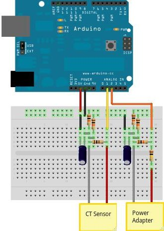

## How to build an Arduino energy monitor - measuring mains voltage and current

***

Including voltage measurement via AC-AC voltage adapter and current measurement via a CT sensor.

This guide details how to build a simple electricity energy monitor on that can be used to measure how much electrical energy you use in your home. It measures voltage with an AC to AC power adapter and current with a clip on CT sensor, making the setup quite safe as no high voltage work is needed.

The energy monitor can calculate real power, apparent power, power factor, rms voltage, rms current. All the calculations are done in the digital domain on an Arduino.

### Step One – Gather Components

**You will need:**

1x Arduino

**Voltage sensing electronics:**

1x 9V AC-AC Power Adapter 
1x 100kOhm resistor for step down voltage divider 
1x 10kOhm resistor for step down voltage divider 
2x 470kOhm (for voltage divider, any matching value resistor pair down to 10K) 
1x 10uF capacitor

**Current sensing electronics**

1x CT sensor SCT-013-000 
1x Burden resistor 18 Ohms if supply voltage is 3.3V or 33 Ohms if supply voltage is 5V 
2x 470kOhm (for voltage divider, any matching value resistor pair down to 10K) 
1x 10uF capacitor

**Other**

1x A breadboard and some single core wire.

### Step Two – Assemble the electronics

The electronics consist of the sensors (which produce signals proportional to the mains voltage and current) and the sensor electronics that convert these signals into a form the Arduino is happy with.

For a circuit diagram and detailed discussion of sensors and electronics see:

- [CT Senors - Introduction](../ct-sensors/introduction)
- [CT Sensors - Interfacing with an Arduino](../ct-sensors/interface-with-arduino)
- [Measuring AC Voltage with an AC to AC power adapter](../voltage-sensing/measuring-voltage-with-an-acac-power-adapter)

**Assemble the components as in the diagram above.**

### Step Three – Upload the Arduino Sketch

The Arduino sketch is the piece of software that runs on the Arduino. The Arduino converts the raw data from its analog input into a nice useful values and then outputs them to serial.

**a) Download EmonLib from github and place in your arduino libraries folder.**

Download: [EmonLib](https://github.com/openenergymonitor/EmonLib)

**b) Upload the voltage and current example:**

<pre>#include "EmonLib.h"             // Include Emon Library
EnergyMonitor emon1;             // Create an instance

void setup()
{  
  Serial.begin(9600);

  emon1.voltage(2, 234.26, 1.7);  // Voltage: input pin, calibration, phase_shift
  emon1.current(1, 111.1);       // Current: input pin, calibration.
}

void loop()
{
  emon1.calcVI(20,2000);         // Calculate all. No.of wavelengths, time-out
  emon1.serialprint();           // Print out all variables
}
</pre>

c) Open the arduino serial window**

You should now see a stream of values. These are from left to right: real power, apparent power, rms voltage, rms current and power factor.

**See also:**

- [How to build an Arduino energy monitor - current only](https://learn.openenergymonitor.org/electricity-monitoring/ct-sensors/how-to-build-an-arduino-energy-monitor-measuring-current-only)
- [EmonTx Arduino Shield](https://wiki.openenergymonitor.org/index.php/EmonTx_Arduino_Shield): Our open-hardware energy monitoring Arduino compatible shield featuring the above circuit.
