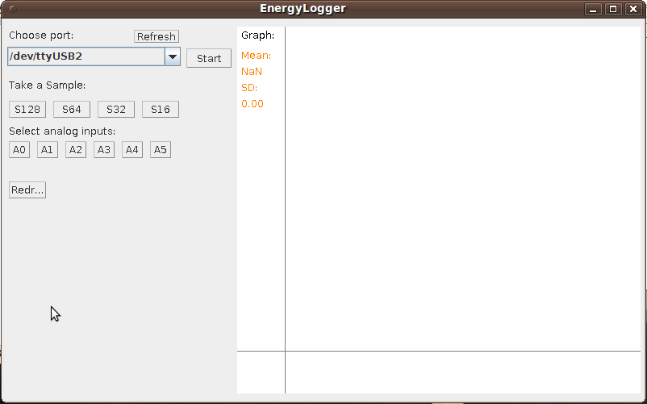

## Sampler 2.0

***

<b>Note:</b> VISampler was written in 2010 and has not been further developed. It can still be used as a useful tool for viewing CT and Voltage waveforms on an Arduino based energy monitor such as the emonTx or self-built monitor.

**Main features**

*   Select arduino from USB port drop down list
*   Take samples at different sample rates
*   Select any analog input or multiple analog inputs
*   See a zoom-able, pan-able graph.
*   Get Mean and Standard deviation of sample

**Download:** [waveform-sampler.zip](files/waveform-sampler.zip)

**To run**

1.  Make sure you have java, rxtx lib installed (see note on rxtx lib below)
2.  Upload SamplerSketch to Arduino
3.  Run SamplerProgram by typing **java Program** into a terminal window (capital P important) in the SamplerProgram directory.
4.  Select USB port and click start!

**Installing RXTX Serial library**

Download and unzip: rxtx-2.1-7-bins-r2.zip from [http://rxtx.qbang.org/wiki/index.php/Download](http://rxtx.qbang.org/wiki/index.php/Download)

Copy librxtxSerial.so to java location (this location has changed over the years some web searching may be required in order to find the location on your computer). On Ubuntu 16.04 in 2017 the following worked:

    sudo cp rxtx-2.1-7-bins-r2/i686-unknown-linux-gnu/librxtxSerial.so /usr/lib/jvm/default-java/jre/lib/ext
    
    sudo cp rxtx-2.1-7-bins-r2/RXTXcomm.jar /usr/lib/jvm/default-java/jre/lib/ext
