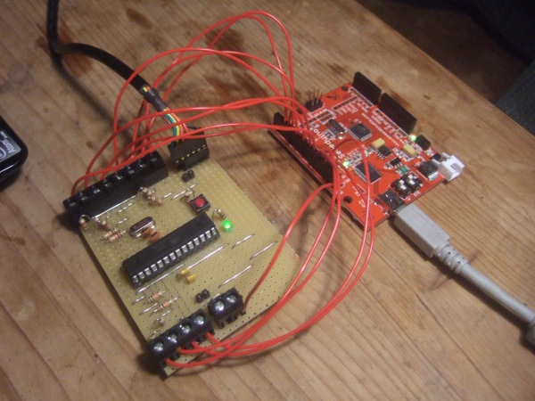

## Pulse Output Accuracy and Precision

## Power test

### Test procedure

The pulse counting Arduino on the left was tested by sending 12 different pulse rates simultaneously from the pulse generator Arduino on the right:

**Pulse Generation**

Using the [pulse generator sketch](node/97) to generate pulse output rates up to 56kW with a pulse every Wh (1000 pulses per kWh)

(56kW was identified to be the maximum stable pulse counting rate)

4, 8,12,16, 20, 24, 28, 32, 36, 40, 44, 48kW in the first run, 52 and 56kW in the second.

**Reading the arduino serial output on the computer**

Serial output was read with **ArduinoComm** **java program** which converts the pulse time into a power value and logs the power values to a file.

Download the particular version of ArduinoComm used for this test here: [ArduinoCommPulseOutput.zip](files/ArduinoCommPower.zip)
Read about how to run it [here](arduinocomm).

**Graphing and statistic calculation in KST**

This file is read in real time by [KST](node/30). Download kst config file here: [12pulsekst.zip](files/12pulsekst.zip)

KST was set to take **100 samples** from which it calculated the: **mean, standard deviation, maximum and minimum**

These values were then put in a table here:

**Download test results** (open office spreadsheet) [PulseOutputPowerTestResults.ods](files/PulseOutputPowerTestResults.ods)

<meta http-equiv="content-type" content="text/html; charset=utf-8">

### Test Results

Standard Deviation of 100 samples: **0.03%**

Error based on 100 sample mean: **0.03%**

Maximum Deviation of any given sample: **0.08%**

### Count test

12 pulse outputs: the first was set at 2kw, the others 24kw up to 44kw.

Pulses were counted over 50 minutes No pulses were missed. Here's the results:

<table border="0" cellspacing="0" cols="2" frame="VOID" rules="NONE"><colgroup><col width="86"> <col width="86"></colgroup>

<tbody>

<tr>

<td align="CENTER" height="17" width="86">**Pulse Gen**</td>

<td align="CENTER" width="86">**Pulse Count**</td>

</tr>

<tr>

<td align="CENTER" height="17" sdnum="2057;" sdval="1664">1664</td>

<td align="CENTER" sdnum="2057;" sdval="1664">1664</td>

</tr>

<tr>

<td align="CENTER" height="17" sdnum="2057;" sdval="36535">36535</td>

<td align="CENTER" sdnum="2057;" sdval="36535">36535</td>

</tr>

<tr>

<td align="CENTER" height="17" sdnum="2057;" sdval="34877">34877</td>

<td align="CENTER" sdnum="2057;" sdval="34877">34877</td>

</tr>

<tr>

<td align="CENTER" height="17" sdnum="2057;" sdval="33219">33219</td>

<td align="CENTER" sdnum="2057;" sdval="33219">33219</td>

</tr>

<tr>

<td align="CENTER" height="17" sdnum="2057;" sdval="31561">31561</td>

<td align="CENTER" sdnum="2057;" sdval="31561">31561</td>

</tr>

<tr>

<td align="CENTER" height="17" sdnum="2057;" sdval="29902">29902</td>

<td align="CENTER" sdnum="2057;" sdval="29902">29902</td>

</tr>

<tr>

<td align="CENTER" height="17" sdnum="2057;" sdval="28244">28244</td>

<td align="CENTER" sdnum="2057;" sdval="28244">28244</td>

</tr>

<tr>

<td align="CENTER" height="17" sdnum="2057;" sdval="26585">26585</td>

<td align="CENTER" sdnum="2057;" sdval="26585">26585</td>

</tr>

<tr>

<td align="CENTER" height="17" sdnum="2057;" sdval="24925">24925</td>

<td align="CENTER" sdnum="2057;" sdval="24925">24925</td>

</tr>

<tr>

<td align="CENTER" height="17" sdnum="2057;" sdval="23266">23266</td>

<td align="CENTER" sdnum="2057;" sdval="23266">23266</td>

</tr>

<tr>

<td align="CENTER" height="17" sdnum="2057;" sdval="21606">21606</td>

<td align="CENTER" sdnum="2057;" sdval="21606">21606</td>

</tr>

<tr>

<td align="CENTER" height="17" sdnum="2057;" sdval="19946">19946</td>

<td align="CENTER" sdnum="2057;" sdval="19946">19946</td>

</tr>

</tbody>

</table>