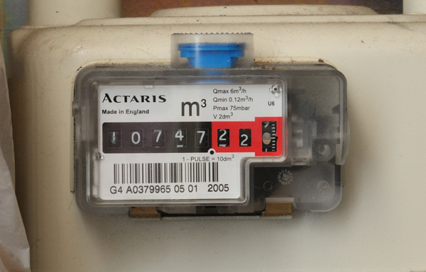
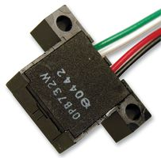

## Gas monitoring

***

This page pulls together information on DIY gas meter monitoring using pulse counting methods.

If you are very lucky, your gas meter has a connector that provides access to the meters pulse output, enabling you to determine gas consumption via pulse counting, see [introduction-to-pulse-counting](introduction-to-pulse-counting).

#### Safety

As far as can be ascertained, the only rule (in the UK, other countries’ standards may vary)
for electricity and gas installations is that the gas meter should be separated by more than
150 mm from the electricity meter, consumer unit or any switch or socket outlet.

Notwithstanding that, escaping gas could be ignited by a spark, so to completely remove
any danger, it is imperative that should a fault occur in the monitoring equipment, there is
no heat source that reaches a high enough temperature, and any spark that might occur
does not have sufficient energy, to ignite the gas. The temperature limitation – 500°C in
the case of hydrogen - can normally be met without difficulty by proper device ratings and
circuit protection, and prevention of ignition by a spark is achievable with the practice
known as “Intrinsic Safety”, which specifies the voltages and currents below which ignition
is not possible. The actual values depend on the gas in question. In the UK, natural gas
supplied to homes is composed predominantly of methane, but hydrogen is the most
easily ignited.

From this, it is clear that, generally, the voltages and currents required by a pulse monitor
will be a long way below even the hydrogen line. The normal way to assure this is to use
an “I.S. Barrier”:

The Zener diodes, normally inactive, are there to blow the fuse should the input voltage
rise under fault conditions. The resistor limits the current to a safe value.

There must also be no significant energy storage device, a capacitor or inductor, on the
hazardous area side of the resistor. Only 0.02 mJ (that’s the energy stored in a 400 nF
capacitor charged to 10 V), is required to ignite hydrogen.

It should not be necessary to install an I.S. barrier in a domestic setting, but if you do,
either for peace of mind or because you think it is necessary, then note that a barrier is
required for every wire that is not earthed that enters the hazardous area. If you do
observe the I.S. rules, you can be certain that every precaution has been taken to
minimise any danger.

References:
https://en.wikipedia.org/wiki/Hydrogen
https://iaeimagazine.org/magazine/2002/11/16/intrinsic-safety/

#### Rotating Ring Counting

The method used counts the revolutions of a dial to determine the volume of gas consumed.

Whilst most meters don't have that capability, many gas meters have a unique "spot" on their rotating disk which can be read with a suitable pickup and electronics. This may be:

1.  A small magnet embedded in the disk. A Hall effect sensor or a reed switch can detect disk rotation.
2.  A reflective spot on the dial that can be read by an infra-red reflective sensor.
3.  A uniquely coloured numeral that can be detected by an infra-red reflective sensor. (can be difficult)

***

### Magnetic Counting

#### Hall Effect

Hall effect sensors can detect a magnetic field. Sensor output is a voltage which varies in response to a magnetic field. A microcontroller with a Hall effect sensor attached to an interrupt line, can count each complete disk rotation.

The image below shows an Actaris gas meter, suitable for monitoring via this method. The magnetic point is visible as a small silver oval on the rightmost digit. The hall effect sensor can be located on the underside of the cut-out section, pointing upwards, or attached directly to the dial face.

Since a gas meter will not usually have a mains power connection located nearby, it's desirable for a Hall effect sensor to be a low-power device. Low power consumption enables use with a battery powered emonTx or JeeNode.

Paul Allen ([MarsFlyer](https://openenergymonitor.org/emon/user/602)) has successfully used a [Melexis MLX90248](http://octopart.com/partsearch#search/requestData&q=MLX90248ESE%20) hall effect sensor. It's average supply current is 10uA. This sensor will react to either a North or South magnetic pole (omnipolar), which simplifies installation. The sensor is supplied as a surface mount SOT23 package which will need to be soldered onto a [breakout board](https://www.sparkfun.com/products/717) to enable wires to be connected.

The sensor mentioned above is difficult to source in the UK, neither RS nor Farnell electronics stock it. A suitable substitute, Diodes AH180N has very similar specifications, is readily available and very low cost. The AH180N is also in a SOT23 package, has an average current consumption of 8-16uA and operates between 2.5 and 5.5 Volts.

#### Reed Switch

A magnetic reed switch has an advantage over a Hall effect sensor in that it requires no
power supply to operate. Otherwise, it is very similar. Reed switches usually (but some
might not) respond equally to magnetic fields of either polarity, but they might be
sensitive to orientation. The switch contacts are sealed inside a glass tube, so in normal
operation there can be no danger of a spark igniting a gas leak.

#### Optical Counting

If the least significant digit of the “register” has a reflective spot, often the centre of the
numeral ‘0’, it is possible to detect this with light, either in the visible band or more usually
in the infra-red. Here are details of a successful implementation of this method.

##### The Sensor

The sensor used is an OPB732WZ Reflective Photo Interrupter, manufactured by Optek
Technology, and available from Farnell Element 14 under Order Code 1678639. It
comprises an infra-red emitter and photo-transistor integrated into one housing, thus
easing alignment problems. It is a long distance reflective switch, and it uses an opaque
housing to reduce the sensor ambient light sensitivity. The emitter and sensor are
protected by a clear window, providing a device that can operate in a dusty environment.

The sensor is mounted in a custom 3-D printed housing, so that it is directly in front of the
reflective spot. Clearly, the method of mounting will need to be adapted for each design of
meter.

##### The Sensor Interface

The sensor interface is a modified version of a design published on Github:
https://github.com/Bra1nK/HomeMonitor/tree/master/Gas%20Meter%20Pulse%20Creator.

As it stands, this design is not intrinsically safe, but it could be modified quite easily to
make it so. It has been changed to operate on a 5 V supply, but with a 3 V pulse output.
The author’s original monitoring system uses a PIC processor operating at 3.3 V, but there
should be no problem interfacing this with any 3.3 V system (emonTx or emonPi), though
the power required means that an emonTx must be supplied from a 5 V d.c supply and not
the a.c. adapter. It is unlikely that battery power would be a realistic means of powering
this as the I.R. emitter in the sensor is continuously on.

##### Adjustment

The most important adjustment is to align the sensor accurately on the register ring with
the reflective spot. The LED brightness should be turned up fairly high, then the threshold
reduced until the reflective spot is just being picked up. Then back off the LED brightness
until the indicator LED goes out when the reflective spot moves on.

<small>[Details and photographs of the reflective optical sensor were provided by a member who wishes to remain
anonymous.]</small>

#### Resources

- [Reflective Spot Counting on Schroder BK-G4 meter](https://github.com/Bra1nK/HomeMonitor/tree/master/Gas%20Meter%20Pulse%20Creator)

- [http://wattdata.blogspot.com/2011/05/gaslog-arduino-measuring-gas-meter.html](http://wattdata.blogspot.com/2011/05/gaslog-arduino-measuring-gas-meter.html)

- [https://github.com/MarsFlyer/ArduinoEnergyProjects](https://github.com/MarsFlyer/ArduinoEnergyProjects)

- [http://sustburbia.blogspot.com/2010/10/gas-meters-revisited.html](http://sustburbia.blogspot.com/2010/10/gas-meters-revisited.html)

- [Using an optical computer mouse to read a rotating dial](https://github.com/kristopher/PS2-Mouse-Arduino)

- [List of common UK gas meters](https://openenergymonitor.org/emon/node/2001)

- [Hall effect sensors & Reed switch debouncing](https://openenergymonitor.org/emon/node/1585)

- [Direct monitoring of power meter pulse using Raspberry Pi & an LDR](https://openenergymonitor.org/emon/node/2017)

- [Gas meter monitoring with Hall effect sensor & reed switch](https://openenergymonitor.org/emon/node/1732)

- [Monitoring Gas meters without pulsed output or magnet](https://openenergymonitor.org/emon/node/3403)

- [British Gas Smart Meters - Part 1](https://openenergymonitor.org/emon/node/2820)

- [emonTH gas with phototransistor or reed switch](https://openenergymonitor.org/emon/node/3600)

##### Battery Power Operation

- [Battery-efficient pulse measurement](https://openenergymonitor.org/emon/node/1943)

- [Power down, watchdog wake up and power computation](https://openenergymonitor.org/emon/node/2489)

##### Pulse Processing Forum Discussion

- [https://openenergymonitor.org/emon/node/3467](https://openenergymonitor.org/emon/node/3467)

- [https://openenergymonitor.org/emon/node/1056](https://openenergymonitor.org/emon/node/1056)
 
- [https://openenergymonitor.org/emon/node/2457](https://openenergymonitor.org/emon/node/2457)
 
- [https://openenergymonitor.org/emon/node/3183](https://openenergymonitor.org/emon/node/3183)
 
- [https://openenergymonitor.org/emon/node/3387](https://openenergymonitor.org/emon/node/3387)
 
- [https://openenergymonitor.org/emon/node/2850](https://openenergymonitor.org/emon/node/2850)
 
- [https://openenergymonitor.org/emon/node/3338](https://openenergymonitor.org/emon/node/3338)