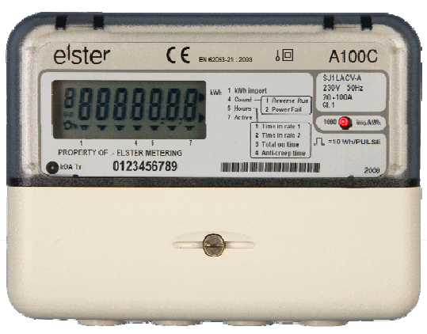
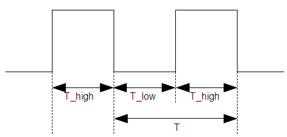
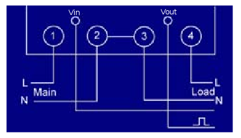
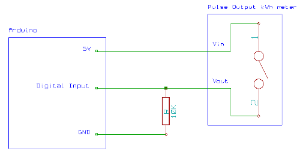

## Monitoring energy via utility meter pulse output

- [Interrupt method](interrupt-based-pulse-counter)

- [Interrupt method sleep](interrupt-based-pulse-counter-sleep)

- [12 input pulse counting via direct port manipulation](12-input-pulse-counting)

- [Gas meter monitoring](gas-meter-monitoring)

## Introduction

Many meters have pulse outputs, examples include: single phase and three phase electrical energy meters, Gas meters, Water meters.

The pulse output may be a flashing LED or a switching relay (usually solid state) or both.

In the case of an electricity meter, a pulse output corresponds to a defined amount of energy passing through the meter (kWh/Wh). For single-phase domestic electricity meters (e.g. the Elster A100c) each pulse usually equals one Wh (1000 pulses per kWh).  With higher power meters (often three-phase), each pulse corresponds to a greater amount of energy e.g. 2, or even 10, Wh per pulse.

### Example meter

- **[A100C BS Single Phase Meter](http://www.elstermetering.com/en/949.html)**

### What is a pulse?

_Figure 1_

Figure 1 illustrates a pulse output. The pulse width T_high varies depending on the meter. Some pulse output meters allow T_high to be set. T_high remains constant during operation. For the A100c meter T_high is 50ms. The time between the pulses T_low is what indicates the power measured by the meter.

**Calculating Energy**
For the A100c meter, each pulse represents 1/1000th of a kWh, i.e. 1 Wh, of energy passing through the meter.

**Calculating Power**
3600 seconds per hour = 3600J per pulse i.e. 1 Wh = 3600J
therefore, instantaneous power **P = 3600 / T** where T is the time between the falling edge of each pulse.

### **Optical pulse counting: Flashing LEDs**

Many electricity meters do not have pulse output connections or the connections are not accessible due to restrictions imposed by the utility company. All modern meters have an optical pulse output LED. In such cases an optical sensor can be used to interface with the meter.

The red pulse-output LED can be seen in the A100c picture above. To detect the pulses from the LED, you need a light sensor. There is a wealth of documentation on the internet on using an Arduino to detect pulsed LED output.

*   An article by AirSensor: [Arduino Electricity Datalogger](http://www.airsensor.co.uk/component/zoo/item/energy-monitor.html) which uses the TSL261 or TSL257 Light to Voltage sensor, Glyn has found the TSL257 Light to Voltage sensor to be best for detecting LED pulses from a Reporter 5193B meter (see notes on optical sensors below).

*   An article by Eric Sandeen [Energy Monitor Proof of Concept](http://sandeen.net/wordpress/?p=227) using an Axman photoreciever
*   An article by Ken Boak: [Using an Arduino to measure gas consumption](http://sustburbia.blogspot.com/2009/11/using-arduino-to-monitor-gas.html)

**Notes on optical sensors (results of initial tests)**

A [TLS257 light-to-voltage converter](http://uk.farnell.com/taos/tsl257-lf/sensor-light-voltage-converter/dp/1226886?Ntt=TSL257) connected directly to an Arduino digital input with a 10K pull down resistor was able to detect a light pulse from Reporter 5193B meter. TLS257 detects light in the visible range. Highly affected by ambient light. Need to good ambient light shielding around sensor. Sensor has the advantage of a built in op-amp to ensure good voltage swing and allow direct Arduino connection. Low cost £1.31 (22/10/10).

The [TLS261 photo diode](http://uk.farnell.com/taos/tsl261r-lf/photodiode-sensor-l-volts/dp/1182350?whydiditmatch=rel_3&matchedProduct=TSL261&Ntt=TSL261) was also tested. Since this sensor is IR it is not affected as much by ambient light. Was able to detect pulses from a bright LED, but not from the Reporter 5193B meter.

### **Wired / Switched output pulse detection**

Many meters also have wired / switched pulse outputs. Many have connection diagrams similar to this one that comes with the A100c. The two smaller holes are the pulse output connections. I have added Vin and Vout labels to make it a little clearer. Vin is provided by an external power supply. Vout is the meter output created by toggling an internal solid state relay (like a switch between Vin and Vout)

**Wired / Switched output supply voltage**

From what I understand, 24V is a fairly standard supply for such meter systems, but other voltages can usually be used. Meters often have a fairly wide pulse output supply voltage range of 3 to 35V. So the 5V supply from an Arduino could be used. Higher voltages are desirable when there is more noise in the environment and the cable runs are longer.

**Safety**

**Watch out for mains connected pulse outputs: **Make sure your meter's pulse output is not connected to the high voltage mains (within the meter). Some meters have one of the pulse output connectors connected to neutral. If your meter is one of these you will need isolation circuitry to interface with an Arduino.

**Live wire proximity: **The pulse outputs are usually very close to live wires, so watch out for those too!

**Circuit**

Pulse output meter to Arduino connection diagram:

****

The 10k resistor keeps the digital input at GND (digital level 0) when the pulse output 'switch' is open.

### **Further reading**

- [http://www.btinternet.com/~jon00/electmon.shtml](http://www.btinternet.com/~jon00/electmon.shtml)

- [http://www.arduino.cc/cgi-bin/yabb2/YaBB.pl?num=1276096046](http://www.arduino.cc/cgi-bin/yabb2/YaBB.pl?num=1276096046)

- [Single optical pulse counting using a JeeNode board and a Hope RFM12 RF module](http://jeelabs.net/projects/cafe/wiki/Electricity_consumption_meter)