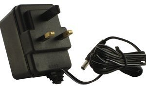
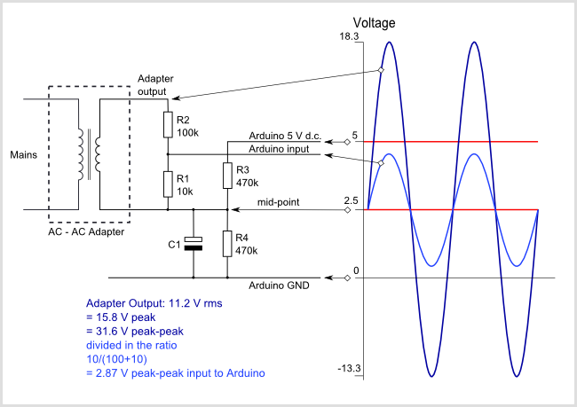

## Measuring AC Voltage with an AC to AC power adapter

***

An AC voltage measurement is needed to calculate real power, apparent power and power factor. This measurement can be made safely (requiring no high voltage work) by using an AC to AC power adaptor. The transformer in the adapter provides isolation from the high voltage mains.

This page briefly covers the electronics required to interface an AC to AC power adapter with an Arduino.

As in the case of current measurement with a CT sensor, the main objective for the signal conditioning electronics detailed below, is to condition the output of the AC power adapter so it meets the requirements of the Arduino analog inputs: a **positive voltage between 0V and the ADC reference voltage** (Usually 5V or 3.3V - emontx).

AC to AC power adapters are available in many voltage ratings. The first thing important to know is the voltage rating of your adapter. We have made a [reference](different-acac-power-adapters) list of the main AC voltage adapters that we have used (we have standardised on a 9V RMS adapter).

The output signal from the AC voltage adapter is a near-sinusoidal waveform. If you have a 9V (RMS) power adapter the positive voltage peak be 12.7V, the negative peak  -12.7V. However, due to the poor voltage regulation with this type of adapter, when the adapter is un-loaded (as in this case), the output is often 10-12V (RMS) giving a peak voltage of  14-17V. The voltage output of the transformer is proportional to the AC input voltage, see below for notes on UK mains voltage.

The signal conditioning electronics needs to convert the output of the adapter to a waveform that has a positive peak that's less than 5V (3.3V for the emonTx) and a negative peak that is more than 0V.

So we need to:

1.  **scale** **down** the waveform and
2.  **add an offset** so there is no negative component.

The waveform can be scaled down using a voltage divider connected across the adapter's terminals, and the offset (bias) can be added using a voltage source created by another voltage divider connected across the Arduino's power supply (in the same way we added a bias for the current sensing circuit).

Here's the circuit diagram and the voltage waveforms:

Resistors **R1** and **R2** form a voltage divider that scales down the power adapter AC voltage. Resistors **R3** and **R4** provide the voltage bias. Capacitor **C1** provides a low impedance path to ground for the AC signal. The value is not critical, between 1 μF and 10 μF will be satisfactory.

R1 and R2 need to be chosen to give a peak-voltage-output of ~1V. For an AC-AC adapter with an 9V RMS output, a resistor combination of 10k for R1 and 100k for R2 would be suitable:

<pre>peak_voltage_output = R1 / (R1 + R2) x peak_voltage_input =
10k / (10k + 100k) x 12.7V = 1.15V</pre>

The voltage bias provided by R3 and R4 should be half of the Arduino supply voltage. As such, R3 and R4 need to be of equal resistance. Higher resistance lowers energy consumption. For a battery powered emonTx, where low power consumption is important, we use 470k resistors for R3 and R4.

If the Arduino is running at 5V the resultant waveform has a positive peak of 2.5V + 1.15V = 3.65V and negative peak of 1.35V satisfying the Arduino analog input voltage requirements. This also leaves some "headroom" to minimize the risk of over or under voltage.

The 10k and 100k R1 and R2 combination works fine for an emonTx powered at 3.3V, with a positive peak of 2.8V and a negative peak of 0.5V.

If you would like detailed information on how to calculate the optimum values for the components, taking component tolerances into account, see [this page](acac-component-tolerances).

### **Arduino sketch**

To use the above circuit along with a current measurement to measure real power, apparent power, power factor, Vrms and Irms upload the Arduino sketch detailed here: [Arduino sketch - voltage and current](https://github.com/openenergymonitor/EmonLib/blob/master/examples/voltage_and_current/voltage_and_current.ino)

### **Improving the quality of the bias source**

This relatively simple voltage bias source does have some limitations. See [Buffered Voltage Bias](acac-buffered-voltage-bias) for a circuit that offers enhanced performance.

### Notes on Mains Voltage Limits

The standard domestic mains supply for Europe is 230 V ± 10%, giving a lower limit of 207 V and an upper limit of 253 V. It is permissible under BS 7671 to have a voltage drop within the installation of 5%, which would give a lower limit of 195.5 V.
The UK standard prior to harmonization was 240 V ± 6%, giving an upper limit of 254.4 V.

Although the UK nominal standard is now 230 V, the supply system has not generally been adjusted, and the voltage centers around 240 V.

Thanks to Robert Wall for summarizing the rather convoluted standards surrounding UK grid voltages.

All of Europe, Africa, Asia, Australia, New Zealand and most of South America, use a supply that is within 6% of 230 V

[https://en.wikipedia.org/wiki/Mains_electricity_by_country](https://en.wikipedia.org/wiki/Mains_electricity_by_country)
