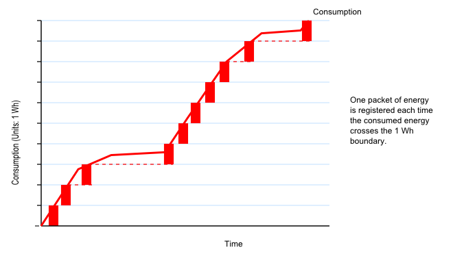
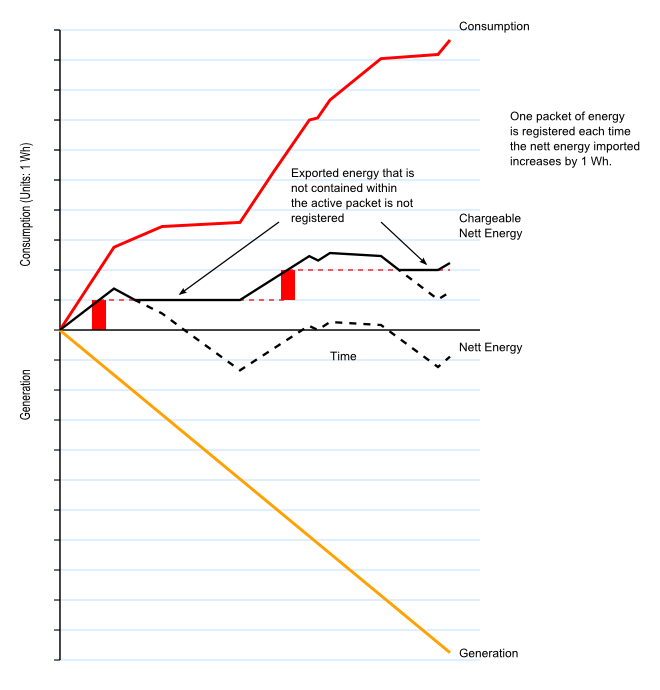

## Energy Meters

***

There are 2 fundamentally different types of energy meter presently in use. The first to appear was electro-mechanical, variously called a disc-type, induction or Ferraris meter.

This meter works on the same principle as the induction motor. An aluminium disc is placed inside a magnetic core with two limbs. One carries a voltage coil so its flux is proportional to voltage, the second carries a current coil so its flux is proportional to current. The two fluxes induce eddy currents to the disc, each of which interacts with the flux of the other to produce a torque, which accelerates the disc. This torque is proportional to flux × the eddy current, which equates to V × I, or power. A permanent magnet creates another eddy current resulting in a torque proportional to speed that brakes the disc, the combined result of these actions is that the speed of the disc is proportional to power, and the total number of revolutions is proportional to the energy that has passed through the meter. The disc drives a chain of gears that turn a mechanical counter, called a ‘register’.

The three-phase meter has three sets of coils and three discs on a common shaft. The torques add mechanically and in this way, the energy registered is the total energy drawn across all three phases.

Because of the mechanical nature of the meter, the moving parts are subject to friction. Although it is possible to alter the magnetic arrangement to produce a small torque that should exactly balance friction, this is rarely achieved in practice (because the customer would complain loudly if the disc were to move when no current was being taken). Therefore most meters have a minimum power below which, they do not register.

Often (but not always), a mechanical ratchet is placed in the mechanism so that rotation in the reverse direction is prevented. This is a fraud prevention mechanism to prevent the recorded value of consumed energy from decrementing if the connections are reversed. The electro-mechanical meter is gradually being replaced by an all-electronic instrument, but one which is designed to match as closely as possible, the properties of its predecessor. Design details are sketchy, however in general terms the overall operation is similar to the emonTx, the design of which, was based on an energy meter demonstration circuit. Some of our knowledge of the behaviour of the electronic meter has come from data sheets and manuals, but most is from tests carried out by members. What follows is a summary of those findings. Although a limited number of makes and types have been tested, it is believed that the data below applies in general. The meter has a “starting current” or “anti-creep” of approx. 20 mA, below which, it records nothing. This mimics the friction of the Ferraris-type mechanism. This is often indicated by a steadily lit LED, which appears some minutes after the current has fallen below the detection threshold.

The meter accumulates energy in packets of 1 Wh (3600 J). When one packet has been recorded, it is passed to the register. This is often indicated by a flash of a LED. If the power flow reverses before the packet is full, the reverse energy is subtracted and the packet empties. When the packet becomes empty, a ‘Reverse Energy Detected’ warning may be displayed. This mimics the rotation of the disc necessary to move the register, and its reverse rotation until stopped by the ratchet. It is possible to “see-saw” energy backwards and forwards through the meter indefinitely without incrementing the register provided that the nett energy remains between 0 and 3600 J. A three-phase meter uses one packet of the same size (3600 J) shared across the three phases. This mimics the three discs on the single shaft of the electro-mechanical meter.

The way that energy packets are allocated and charged is illustrated below. When no energy is being generated and the entire flow of energy through the meter is consumption, a packet is allocated each time the accumulated energy crosses the 3600 J boundary.

If generation is taking place, the nett flow of energy is the difference between consumption and generation. As consumption falls and generation takes over, the current packet empties, and when it is empty, further export power that cannot be contained within the current packet is ignored.

#### Exploiting the Meter with a Dump Load Controller

The diagram above gives us a hint about how we can exploit the meter’s properties so that energy generated by (say) a PV installation can be used to best advantage. If we can somehow keep the nett energy consumption within the bounds of a single energy packet, then we neither increment the register and incur a charge, nor export the energy for a payment that is invariably less than we pay to purchase the same amount of energy. What is needed is a way of putting the surplus energy to good use, and doing it in a closely controlled way.

A convenient, but not the only, use for our surplus energy is to heat water. It’s convenient because most of us have domestic hot water systems that are primarily heated by fossil fuels—gas or oil—but also have a secondary heat source in the form of an immersion heater. And it is relatively simple to control the flow of energy delivered to an immersion heater so that it balances the surplus energy we are generating.

The operating principle of the controller is to match the operating condition of the meter’s energy packet, and to control the immersion heater—our dump load—so that as the energy in the packet falls towards the point where the packet will empty and energy will be returned to the supply, we switch on or increase the power to the dump load; and when the energy in the packet rises towards the point where we incur a charge, we switch off or decrease the power to the dump load.

Switching the dump load at 10% and 90% of the packet capacity.

This is the principle used in the [Mk2 Router](/emon/mk2), a fully engineered system that will route surplus energy to an immersion heater operating as a dump load.

Since writing the above, it has been noted that the Itron/Landis & Gyr/Actaris ACE1000 meter uses a ‘packet’ of 1250 J, and the Ampy 5193A has a 'packet' of 3000 J. The Landis & Gyr E110, when exporting, flashes its LED but does not increment the register.  The three-phase Elster 1700, when exporting, also flashes its LED but does not increment the register.

The French Landis & Gyr L16C6 is thought to have a very small energy packet size, such that the burst mode energy diverter is reported to NOT work at any energy-packet-size setting, though it does behave as expected when phase control is used.

Acknowledgements.

The work of Paul Reed, MrSharkey, Calypso_rae, Stuart , MartinR, Tinbum & 9fingers:

[https://openenergymonitor.org/emon/node/696#comment-4558](https://openenergymonitor.org/emon/node/696#comment-4558)

[https://openenergymonitor.org/emon/node/17](https://openenergymonitor.org/emon/node/176)

[https://openenergymonitor.org/emon/node/1613](https://openenergymonitor.org/emon/node/1613)

References

[Advanced Electrical Engineering, A.H.Morton, Pitman Paperbacks](https://www.amazon.co.uk/Advanced-Electrical-Engineering-Pitman-paperbacks/dp/0273401726)

[Autometers Single and Three Phase Meters](http://www.autometers.co.uk/uploads/products/documents/S12_S34-Brochure.pdf)

[ABB Electricity Meter](http://library.e.abb.com/public/318ef6a97922cb44c1257cee00450e9b/DZ_XXXX_TD_EN_V1-1_2CDC512007D0201.PDF)

[Ampy 5192 Polyphase Meter](http://universalmeterservices.co.uk/store/images/Ampy%205192.pdf)

[Ampy / Landis & Gyr 5235 Single Phase Meter](http://www.contemporaryenergy.co.uk/PDF/LandisGyr%20generation%20meter%205235_User_Manual_Version_5_0.pdf)

[Siemens S2AS Single Phase Meter](http://www.meterspec.com/522.pdf)

[Operation of electricity meters when energy flowing in reverse](http://www.meteroperators.org.uk/images/FAQ_and_Stakeholder_Info/Reverse_running_meters_20130820.pdf) [pdf]
