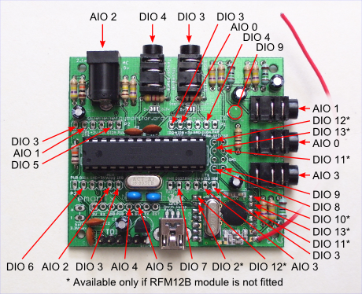
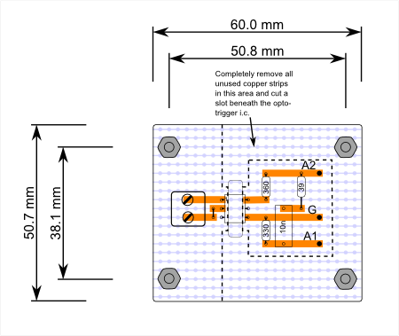

## Diverting surplus PV Power, by Robin Emley (updated, to include the emonTx hardware, by Robert Wall)

[<< 7: Calibration of power and voltage, plus phase-alignment](calibration)

[9: Different versions of the software sketch >>](versions)

### 8: Building a Mk2 PV Router

As mentioned on the Contents page, two different hardware platforms have been successfully used to support Mk2 PV Routers.

**_[Update at 7/3/14:  Since writing this article, I have developed a new hardware platform which has been specifically designed  for this product.  The main board has an integral power supply and RF module, and there is a display to show how much surplus energy has been diverted each day.  Two of the PCBs can be mounted directly inside an enclosure from Schneider Electric; this can be either ABS or polycarbonate._**

**_This new venture of mine is fully described at [www.Mk2PVrouter.co.uk](http://www.Mk2PVrouter.co.uk)  where there is a Shop which can supply all of the necessary components either in kit-form or pre-built and tested.  The information below is still entirely valid, and this article is referenced from my website as supporting material.]_**

The emonTx was originally thought by the author to be less suitable for the Router application than a bespoke hardware platform. However, both the emonTx and the Arduino Uno versions have since been shown to give equivalent performance, so the choice is really down to how well the features of each version match the requirements for each constructor’s needs.

All of the author’s software runs equally well on either platform.

All of the necessary information to construct a basic Mk2 router may be found in the initial posting on the OEM forum at [https://openenergymonitor.org/emon/node/841](https://openenergymonitor.org/emon/node/841) and this is essentially the same for whichever version is chosen. This includes a schematic diagram which covers the circuitry for both of the input sensors and the output stage. The sensors for [voltage](https://openenergymonitor.org/emon/buildingblocks/measuring-voltage-with-an-acac-power-adapter) and [current](https://openenergymonitor.org/emon/buildingblocks/ct-sensors-interface) are entirely standard and are well described in the Building Blocks section. Buffering the 2.5 V reference is not essential. Many constructors have used two independent references, as may be found on the emonTx platform, with no problems.

Although the input stage is both low-voltage and non-invasive, the output stage will require some connection to the mains supply. If at all unclear about how this should be done, it would be wise to seek guidance from a qualified electrician.

Some form of power supply will be needed for the processor. For setup purposes, power via the programming lead from the USB socket of a laptop or PC is fine, but for continuous use, a permanent power supply should be arranged.

The OEM shop stocks various items which may be of use:

*   [Current Transformer (CT)](https://shop.openenergymonitor.com/100a-max-clip-on-current-sensor-ct/), for the current sensor
*   [AC/AC adaptor](https://shop.openenergymonitor.com/ac-ac-adapter-uk-plug/), for the voltage sensor
*   [psu](https://shop.openenergymonitor.com/power-supplies/), for the Arduino or alternative controller
*   the [emonTx](https://shop.openenergymonitor.com/emontx-kit-no-rf/), as an alternative to the [Arduino Uno](http://arduino.cc/en/Main/ArduinoBoardUno)

#### The author’s original design of hardware

The Mk2 Router sketch was originally intended to run on an Arduino Uno. This required a pair of input sensors to be constructed as shown in the original ‘Mk2’ posting on the forum.

A breadboard layout is fine for short-term assembly of the input sensors, but for a permanent installation, ‘Stripboard’ is a favoured method for many home construction projects. Alternatively, a PCB for these sensors, which also incorporates a small AC transformer for the voltage sensor, can be purchased from a forum member. A second PCB is provided for the output components. Details can be found at [https://openenergymonitor.org/emon/node/2044](https://openenergymonitor.org/emon/node/2044)

The combination of a standard Arduino Uno, and a pair of PCBs for the input and output components, makes for a very straightforward construction of a basic Mk2 Router. If the PCBs are purchased bare, this is probably the cheapest way to obtain a basic working system.

PCBs are also available in a kit with the input and output components, either for DIY-assembly or with the circuit boards pre-assembled.

**Limitations:**

*   The PCB option is limited to just one CT. Although this is fine for the router in its basic function, many constructors have found it desirable to measure current in at least one additional location for stats purposes.
*   Unlike the shop-sourced AC/AC adapter, the pcb-mounted transformer has not been formally tested for suitability in this application.
*   No RF unit is included, but this could be added by following the guidance at [https://openenergymonitor.org/emon/buildingblocks/rfm12b-wireless](https://openenergymonitor.org/emon/buildingblocks/rfm12b-wireless)

#### The emonTx hardware

(This section applies particularly to the emonTx V2.)

The emonTx provides an RF-ready sensor platform with multiple inputs. The AC/AC adaptor for the voltage sensor needs to be purchased separately. This adapter has been formally tested as being suitable for this application and is inherently safe. Full [construction details](https://openenergymonitor.org/emon/emontx/make/assemble/buildguide22) are available. It is possible to use the pulse input jack socket (DIO 3) to connect to the opto-isolator I.C and if that is done, the emonTx can be assembled exactly according to the build guide. In the unlikely event that the pulse input is required, or if extra outputs are needed, then a 3-pin header needs to be added to the port or ports of your choice (DIO 4-7) to provide the connection.

_The emonTx I/O connections._

#### Using the emonTx V3

The emonTx V3.2, which uses the RFμ 328 module, can be used provided that the high sensitivity opto-trigger described in [Choosing an Energy Diverter](https://openenergymonitor.org/emon/Choosing%20an%20Energy%20Diverter) is used. The same applies to the emonTx V3.4 if the RFM12B radio module is fitted. If the emonTx V3.4 is fitted with the RFM69CW radio module, operation using the ac adapter as the sole power supply is not guaranteed and an external 5 V power supply should be used.

#### Using the emonTx Shield

It should be possible to use the emonTx Shield along with an Arduino Duemilanove, Leonardo or Uno instead of the emonTx. This will replace the p.c.b. for the voltage and current inputs, but as with the emonTx, a p.c.b. or stripboard for the output stage will still be required. The different input configuration will also necessitate some changes to the sketch.

#### The output stage hardware

If it is not convenient to route the power wiring close to the measurement point, it is easy to separate the controller from the triac assembly. A simple low voltage twisted pair (‘telephone’ or CAT5) cable is all that is required to link the two parts, and it should be good for many tens of metres. If the two parts are in the same enclosure, the current limiting resistor may be more conveniently located on the output circuit board, as shown for the emonTx V3.

_Output stage circuit diagram for emonTx V2._

_Output stage circuit diagram for emonTx V3._ The differences between this and the emonTx V2 are explained in the [overview](https://openenergymonitor.org/emon/Choosing%20an%20Energy%20Diverter).

The pcb for the output components mentioned above may be used with both the Arduino Uno and emonTx variants, and is available separately. Details can be found at [https://openenergymonitor.org/emon/node/2044](https://openenergymonitor.org/emon/node/2044).

Alternatively, ‘Stripboard’ is the favoured method for many home construction projects.

_Suggested stripboard layout – component side. The 75 Ω or 180 Ω current-limiting resistor may be mounted here if desired (with a minor modification to the low voltage side)._

The optoisolator I.C. provides adequate isolation between the low voltage circuit and the mains **provided** its integrity is not compromised by the circuit board layout. You should have at least 7 mm of “creepage distance” between the high voltage and low voltage sides, and the only way to achieve this will be to cut a slot beneath the opto-isolator I.C, as shown.

The recommended triac is an insulated tab device, meaning that it is possible to bolt the tab directly to the heat-sink. However, an insulation kit comprising a silicone rubber washer and insulated bush is recommended and might improve the heat transfer from the device to the heat sink. In any event, the heatsink will need to be either outside the box or the box itself for performance reasons, so if touchable must be solidly earthed, and the high voltage wiring must be appropriately rated and insulated. All other live parts must be enclosed in an earthed metal box or double-insulated.

Circuit protection.

It is not economic to include a fuse or circuit breaker that will protect the recommended triac in every possible circumstance (even though it is grossly over-rated for the duty) and therefore it should be possible to replace it easily in the event of failure. See [Overload Protection of Mains Electrical Circuits](https://openenergymonitor.org/emon/buildingblocks/overload-protection-of-mains-electrical-circuits) for more information.

#### Testing

Having assembled the basic components (i.e. voltage and current sensors, and the processor), the measurement side of the system can then be tested. Various tools are available to allow this part of the system to be thoroughly checked. "Tallymode", in any of the later Mk2 builds, provides an easy means for accurate calibration of the system. Although an AC supply is needed to stimulate the sensors, and to power the processor if a USB supply is not being used, no direct connect to the mains is required at this stage.

With the measurement side in order, the output stage needs to be tested. Any convenient appliance can be used as a temporary dump load for system checks; an immersion heater is not required. By running one core of the cable of the output circuit through the same CT as is measuring the PV, feedback is established so that the system can operate in a state of balance just as it would when working for real. A [video](http://www.youtube.com/watch?v=lefSTLTfUN0) which shows this technique in action is mentioned in my [Mk2 summary list](https://openenergymonitor.org/emon/node/1757).

#### A suggested test-rig for the Mk2 PV Router:

The use of “Tallymode” can provide a complete picture of the system in its working state. By this means, a high degree of confidence can be obtained on a test rig before the hardware is moved its final location.

My recommended order of activities would be:

*   check that you can communicate with your Arduino. Does the “blink” sketch work?
*   connect the voltage and current sensors to suitable test circuits
*   run the [MinAndMaxValues](files/minAndMaxValues.ino_.zip) tool to check that the ADC’s output values are scaled appropriately for the values of voltage and current that are to be measured (80-90% of full scale is ideal). A second tool, [RawSamplesTool](files/rawSamplesTool.ino_.zip), provides a one-shot display of the samples that are taken during a single mains cycle
*   adjust the value for voltageCal if necessary (see sketch for details)
*   run “Tallymode” in any of the later sketches to check/adjust the calibration for power
*   check the o/p stage. The load should go on at 1800 J. If it doesn’t, try reversing the CT.
*   set up a balance test with a 60 W bulb or similar for the ‘PV’. The load should ‘flicker’.
*   run any of the later builds in anti-flicker mode. It should still cycle, but more slowly
*   Congratulations. You appear to have a working system.

_NOTE: All versions of the Mk2 PV Router require the CT’s direction to be such that the energy bucket’s level **increases** when power is being **exported**, and **decreases** when power is being **imported**. This is the opposite way around to the guidance in the OEM’s [Solar PV Application Note](https://openenergymonitor.org/emon/applications/solarpv)._

#### A typical installation:

#### How to simulate more current by using multiple turns through the CT:

[<< 7: Calibration of power and voltage, plus phase-alignment](calibration)

[9: Different versions of the software sketch >>](versions)
