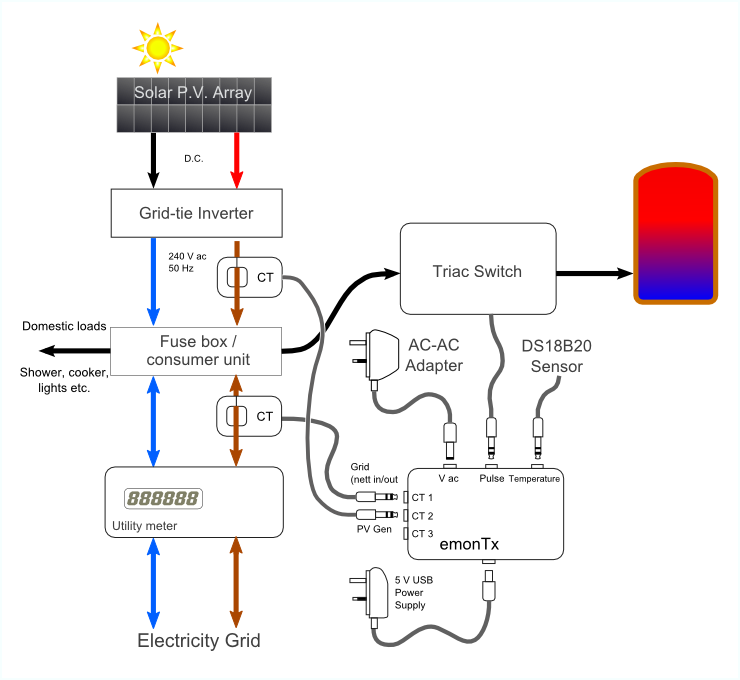
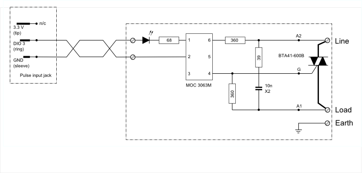
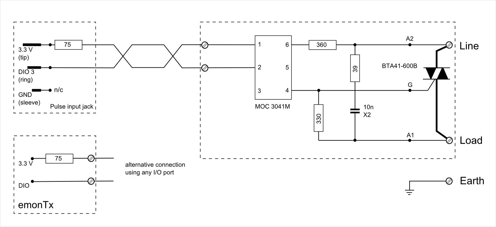

## Solar PV power diversion with emonTx using a PLL, emonGLCD and temperature measurement, by Martin Roberts

### 9: Hardware

### Original triac switch output stage

The original sketch uses the pulse jack socket on the emonTx V2 as the output to the triac driver. For the test setup Martin used a 68 Ω resistor in series with a normal LED and the MOC3063 triac driver. The MOC3063 is a low current device.

For the emonTx V3 using the ac adapter as the power supply, the circuit in [Choosing an energy diverter](https://openenergymonitor.org/emon/Choosing%20an%20Energy%20Diverter) must be used on account of the limited current available from the rectifier circuit (note the use of the more sensitive MOC3043M and the increased value of the series resistor).

### Alternative triac switch output stage

It is possible to use exactly the same output stage as Robin Emley’s design, in which the driver is wired to the tip and ring of the plug, but a small change is required to invert the triac signal in the sketch: in the three places where “digitalWrite(TRIACPIN, …)” appears, change LOW to HIGH and vice versa. The higher current required by the driver means that the series LED cannot be used. If a indication of operation is required, then a LED with its own series resistor in parallel with the driver should be employed.

The pcb for the output components mentioned in Robin’s article may be used and is available separately. Details can be found at [https://openenergymonitor.org/emon/node/2044](https://openenergymonitor.org/emon/node/2044) (but note that there is no provision for the LED to be mounted on-board).

Alternatively, ‘Stripboard’ is the favoured method for many home construction projects.

_Suggested stripboard layout – component side. The current-limiting resistor (68 Ω, 75 Ω or 180 Ω) and the LED may be mounted here if desired (with a minor modification to the low voltage side)._

The optoisolator I.C. provides adequate isolation between the low voltage circuit and the mains **provided** its integrity is not compromised by the circuit board layout. You should have at least 7 mm of “creepage distance” between the high voltage and low voltage sides, and the only way to achieve this will be to cut a slot beneath the opto-isolator I.C, as shown.

The recommended triac is an insulated tab device, meaning that it is possible to bolt the tab directly to the heat-sink. However, an insulation kit comprising a silicone rubber washer and insulated bush is recommended and might improve the heat transfer from the device to the heat sink. In any event, the heatsink will need to be either outside the box or the box itself for performance reasons, so if touchable must be solidly earthed, and the high voltage wiring must be appropriately rated and insulated. All other live parts must be enclosed in an earthed metal box or double-insulated.

**Circuit protection.**

It is not economic to include a fuse or circuit breaker that will protect the recommended triac in every possible circumstance (even though it is grossly over-rated for the duty) and therefore it should be possible to replace it easily in the event of failure. See [Overload Protection of Mains Electrical Circuits](https://openenergymonitor.org/emon/buildingblocks/overload-protection-of-mains-electrical-circuits) for more information.
