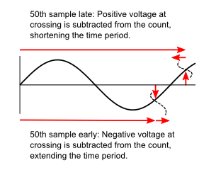

## Solar PV power diversion with emonTx using a PLL, emonGLCD and temperature measurement, by Martin Roberts

### 3: What is a PLL? – operating principle.

A Phase Locked Loop (PLL) is a particular form of a closed loop control system. It is often used, as here, to follow the changes in frequency of some incoming signal. In our case, that is the mains electricity supply.

If we set up our emonTx to measure the mains voltage and current 2500 times per second, (that’s 50 times per cycle in the UK) then as long as the mains frequency remains at 50 Hz, and as long as the crystal clock in our emonTx is accurate and doesn’t drift, then we will indeed take exactly 50 measurements in each cycle, and on successive cycles each measurement will be at exactly the same place on the wave. Clearly, in practice even if we can start out like this, it won’t stay like it for long. Both the mains frequency and our crystal can drift, and so the measurements will slide backwards and forwards along the wave as the two frequencies change relative to each other.

To stop this from happening, we must control the frequency at which we make the measurements so that they happen at exactly the same place on the wave each time. If we say that we will start measuring when the mains voltage crosses zero going positively, then the 51st measurement should again be zero. If our clock is running fast, we will get there early and the voltage will be negative and we need to slow our clock; on the other hand, if we are late the voltage will be positive and we need to speed our clock up. So we are not only locking our clock and the frequency of our measurements to the mains, we are also locking every 50th measurement to the positive-going zero crossing of the voltage. We have a phase locked loop.

