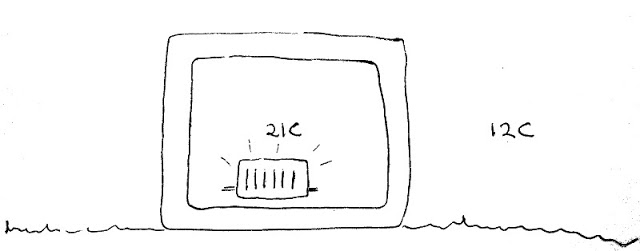

## Building fabric heat loss, thermal conductivity and U-values

Building fabric heat loss is heat loss through building elements such as:

- Wall's
- Floor
- Loft/roof
- Doors and windows
- Thermal bridges

Heat loss is calculated using the physics equation for heat conduction:

    Heat Loss = k x A x (TINTERNAL - TEXTERNAL) / l

    k = thermal conductivity of the element material
    A = cross sectional area of the element
    l = element thickness

(HyperPhysics: [Heat conduction](http://hyperphysics.phy-astr.gsu.edu/hbase/thermo/heatra.html#c2))

**Example:**

Imagine a house that is a hollow cube of uniform material, no windows, no openings, no draughts, just a simple hollow cube.

Lets say this cube house is made of nothing but mineral insulation 100mm thick, with internal dimensions: 7m wide, 7m long and 7m high.

Our cube house is situated in a climate with no wind or solar gain just a stable 12C outside air temperature year round.

How much energy would it take to keep this hypothetical house at a stable 21C?

As we heat the house, heat will flow from the hotter internal air through the walls to the colder external air via conduction and so the equation that we need is the fundamental physics equation for heat conduction.

    H = (kA / l) x (Tinternal – Texternal)
    

See the great hyperphysics site for more on the [heat conduction equation](http://hyperphysics.phy-astr.gsu.edu/hbase/hframe.html) and everything else physics.

The [Wikipedia table on material thermal conductivity](http://en.wikipedia.org/wiki/List_of_thermal_conductivities) tells us that mineral insulation has a thermal conductivity of 0.04 W/mK. We can take the area of the material to be the internal area of our cube house (imagine folding the cube house out so that we just have this one dimensional wall of area A and thickness l), there is of course a difference between the internal area and the external area of our cube house but lets come back to that one later and take the internal area for now which is:

    7m x 7m x 6 surfaces = 294 m2

Putting the numbers into the heat conductivity equation we get:

    H = (0.04 x 294 / 0.1) x (21 – 12) = 1529 Watts
    
And so we find we would need a fairly standard 1.5kW heater to keep our cube house at 21C.
1529W continuously would work out to being 37 kWh per day and 13392 kWh/year.

Heat loss through building elements is one of the main cornerstones of a building energy model. But in models such as SAP its not usually referred to as the heat conductivity equation nor is the thermal conductivity of a material the usual starting point. Instead models like SAP start with a building elements U-value and an equation that looks like this:

    Heat loss = U-value x Area x Temperature Difference

For an element made of a single uniform material the U-value is simply the materials thermal conductivity k divided by its thickness. But building elements are only sometimes single uniform materials, a building element can also be an assembly of different materials such as a timber stud wall with insulation, membranes and air inside. The physical process of heat transfer through the element may also be a mixture of conductive, convective and radiative heat transfer.

In the case where a material is uniform the heat loss through a building element equation is the same as the basic equation for heat conductivity and the U-value is just the k/l part lumped together into one constant.

The U-value of our 100mm mineral insulation wall would therefore be: 

    U-value = k / l = 0.04 / 0.1 = 0.4  W/m2.K.

If you have a composite of materials, say a layer of wood and then a layer of insulation its possible to calculate the overall U-value in the same way as we calculate the equivalent resistance of parallel resistors in electronics.

For further reading on U-values see [U-values definition and calculation](http://www.architecture.com/SustainabilityHub/Designstrategies/Earth/1-1-1-10-Uvalues(INCOMPLETE).aspx) by the RIBA.
