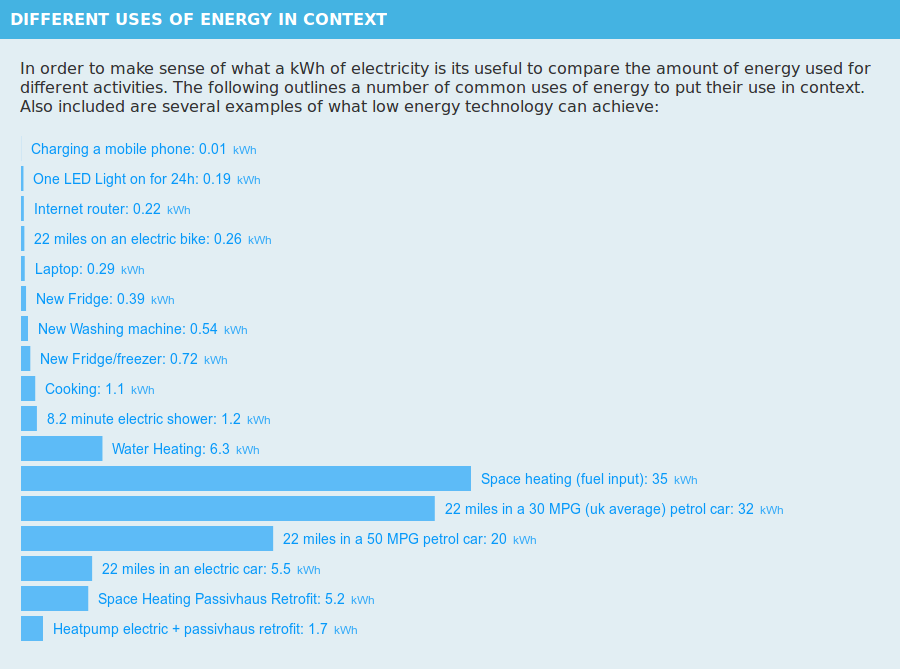

### Data sources and working

**Charging a mobile phone: 0.01 kWh** 
A Motorola G battery is rated at 3.8V and 2010 mAh. 3.8V x 2.010Ah = 7.64 Wh.
Assuming a 90% efficient charger 7.64 / 0.9 = 8.5 Wh or near enough 0.01 kWh with a bit of leeway for larger battery packs and less efficient chargers.

** One LED Light on for 24h: 0.19 kWh** 
Using a Pharox LED 40W equivalent 8 Watt bulb  [http://www.lampandlight.co.uk/pharox-led-bulb-400-e27-40w.html](http://www.lampandlight.co.uk/pharox-led-bulb-400-e27-40w.html)
 (8W x 24 x 3600) / 3600000 = 0.192 kWh

**Internet router: 0.22 kWh** 
A BT Home Hub uses 10W while fully on and 7W in power saver. Assuming the average power is 9W. (9W x 24 x 3600) / 3600000 = 0.216 kWh

**22 miles on an electric bike: 0.26 kWh** 
With a generous electric assist level removing most of the work out of climbing hills an electric bike can achieve around 12 Wh/mile (83 miles/kWh). Traveling the average daily household mileage of 22 miles on an ebike adds up to 22 x 0.012kWh/mile = 0.26 kWh/d.

**Laptop: 0.29 kWh** 
A dell XPS battery has a designed capacity of 47.3 Wh.

**Fridge: 0.39 kWh** 
From ECUK_Tables_2016.xlsx, Table 3.09 total energy consumption of new appliances.
 A washing machine uses 141 kWh/year, or 0.39 kWh/d.

**Washing machine: 0.54 kWh** 
From ECUK_Tables_2016.xlsx, Table 3.09 total energy consumption of new appliances.
 A washing machine uses 198 kWh/year, or 0.54 kWh/d.

**Fridge/Freezer: 0.72 kWh** 
From ECUK_Tables_2016.xlsx, Table 3.09 total energy consumption of new appliances.
 A washing machine uses 261 kWh/year, or 0.72 kWh/d.

**Cooking: 1.1 kWh** 
From ECUK_Tables_2016.xlsx, Table 1.03 domestic cooking consumed 991 ktoe in 2013. 
991 ktoe x 11630000 kWh / 27,000,000 households = 427 kWh
In kWh per day: 427 / 365 = 1.17 kWh/d.

Conversion factor for calculating 2015 amount from 2013 =
Total of non transport domestic consumption 2015 / Total of non transport domestic consumption 2013 = 82,620/88,586 = 0.933

1.17 kWh/d x 0.933 = 1.1 kWh/d

**8.2 minute electric shower: 1.23 kWh** 
9kW shower x (8.2 x 60) / 3,600,000 = 1.23 kWh

**Water Heating: 6.3 kWh** 
From ECUK_Tables_2016.xlsx, Table 1.03 domestic water heating consumed 5676 ktoe in 2013. 
5676 ktoe x 11630000 kWh / 27,000,000 households = 2445 kWh
In kWh per day: 2445 / 365 = 6.7 kWh/d. 
6.7 kWh/d x 0.933 (conversion factor as above) = 6.3 kWh/d

**Space heating (fuel input): 34.8 kWh** 
From ECUK_Tables_2016.xlsx, Table 1.03 domestic water heating consumed 31,609 ktoe in 2013. 
31,609 ktoe x 11630000 kWh / 27,000,000 households = 13615 kWh
In kWh per day: 13615 / 365 = 37.3 kWh/d. 
37.3 kWh/d x 0.933 (conversion factor as above) = 34.8 kWh/d

**22 miles in a 30 MPG (uk average) petrol car: 32 kWh** 
From the Department for Transports National Travel Survey (nts0410): 22 miles is the average distance travelled by car per household per day in the UK. 3268 vehicle miles per person x 2.41 people per household = 7876 miles/year = 22 miles per day.

The average petrol car efficiency in the UK is 30 MPG or 0.68 miles/kWh see energy overview calculation.
 22 miles per day therefore uses 22 / 0.68 = 32 kWh.

**22 miles in a 50 MPG petrol car: 19.5 kWh** 
Newer more efficient petrol cars can of course get much better than this. 50 MPG is equivalent to 1.13 miles/kWh.
 22 miles per day therefore uses 22 / 1.13 = 19.5 kWh.

**22 miles in an electric car: 5.5 kWh** 
The Nissan Leaf 100 mile electric car uses around 4.0 miles/kWh.
 22 miles per day = 22 / 3.0 = 5.5 kWh.

**Space heating passivhaus retrofit: 5.2 kWh** 
The passivhaus standard for retrofit is 25 kWh/m2/year. If we multiply this by the average dwelling floor area of 76 m2 and then divide by the number of days in a year we get (25 x 76) / 365 = 5.2 kWh/d.

**Heatpump electric + passivhaus retrofit: 1.7 kWh** 
Assuming a heat pump performance of 3.0 units of heat output for every unit of electrical input, the electricity consumption required to provide 5.2 kWh/d of heat output is 5.2 / 3.0 = 1.7 kWh/d.
